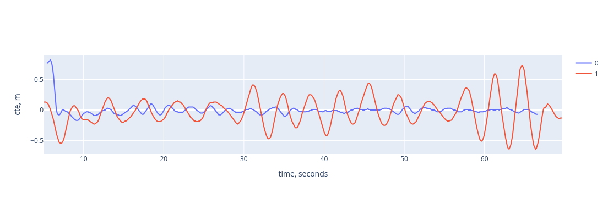
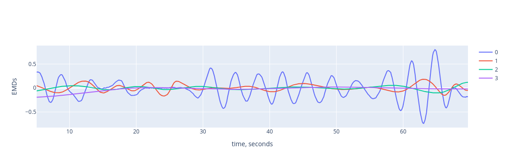
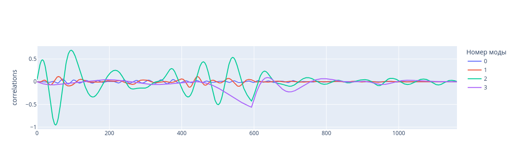

# Описание алгоритма
### Инициализация:
* телеметрия текущего проезда - pd.DataFrame
* телеметрия эталонного проезда - pd.DataFrame
* список мод, по которым ведётся сравнение, или [], если по всем
* список с названиями столбцов,по которым ведётся сравнение

Входные данные, 0 - эталонный проезд, 1 - текущий

### Моды
После инициализации каждый указанный столбец текущего и эталонного проездов раскладывается на [эмпирические моды](https://ru.ruwiki.ru/wiki/Empirical_Mode_Decomposition) с помощью метода [emd.sift.sift](https://emd.readthedocs.io/en/stable/stubs/emd.sift.sift.html). Считается количество экстремумов для каждого указанного столбца с помощью метода [emd.sift.get_padded_extrema](https://emd.readthedocs.io/en/stable/stubs/emd.sift.get_padded_extrema.html).  

Моды

### Сравнение
Все получееные моды нормируются на свою энергию: $E= \int_{0}^{T} s^2(t)dt $.   
Полученные моды для текущего проезда сравниваются с эталонным проездом [функцией корреляции](https://ru.ruwiki.ru/wiki/Автокорреляционная_функция) 
[scipy.signal.correlate](https://docs.scipy.org/doc/scipy/reference/generated/scipy.signal.correlate.html). После вычисления функции корреляции берутся масимумы модулей (то есть пики функции) и усредняются по модам. Сравниваются два числа - результат осреднения пиков функций и предельное значение - эмпирически подобранная константа, на основе этого сравнения делается результат о наличии или отсутствии виляний.  

Корреляция

### Артефакты
* Моды:
  - etalon_modes - эталонные - dict, ключи-строки (названия столбцов, по которым ведётся раздожение), значения - ndarray, индекс - номер моды
  - current_modes - текущие - dict, ключи-строки (названия столбцов, по которым ведётся раздожение), значения - ndarray, индекс - номер моды
* Количество экстремумов:
  * extremes - текущее - dict, ключи-строки (названия столбцов, по которым ведётся раздожение), значения - количество экстремумов
  * etalon_extremes - эталонное - dict, ключи-строки (названия столбцов, по которым ведётся раздожение), значения - количество экстремумов
* Окна виляний:
  * wagging - окна виляний - dict, ключи-строки, значения - pd.DataFrame отрезка, на котором есть виляния
* Результат работы алгоритма (есть виляния/нет виляний):
  * ProcessingAlgorithm().calculate()

### Пример
В файле sandbox/description.ipynb
